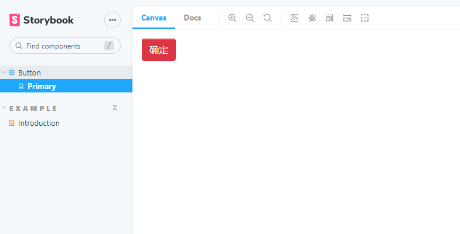

### 项目说明

该项目是尝试开发组件

```
npm run build
# 查看组件效果
npm run storybook 
```



npm使用说明

```
# 新建一个项目
create-react-app xxx-test

# 安装包
npm install fur-design-component

# index.js 中引入css文件
import "fur-design-component/dist/index.css";

# App.js 中使用
import { Button } from "fur-design-component"
<Button btnType="primary">确定</Button>
```

